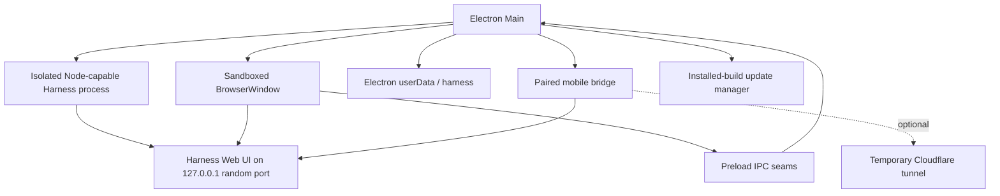

# DSH Desktop architecture

DSH Desktop is an Electron host for the existing DeepSeek Harness runtime and Web UI. It does not maintain a second agent runtime or reimplement the Harness frontend.

## Runtime topology



On macOS, Harness runs in an Electron UtilityProcess with Node capabilities. On Windows, it is launched with the bundled target-native Node.js executable. Cordis HMR's `--expose-internals` permission is granted to that isolated process and never to the web renderer.

## Startup flow

1. Configure a stable production or development application identity and user-data directory.
2. Acquire the single-instance lock.
3. Create the application-owned `launch-root` directory.
4. Open the startup surface and inspect the normal web profile.
5. Pin the profile's pnpm store and repair incomplete package state when needed.
6. Start Harness on an available `127.0.0.1` port with the tracked desktop patch layer.
7. Poll the endpoint until it remains healthy, then load it into the main window.
8. Start the paired mobile bridge and, in installed builds, the update manager.

Harness restarts reuse the same application-owned data. Safe Mode starts a separate profile containing official core bundles while leaving normal-profile plugins blocked.

## Persistent data

```text
Electron userData/
├── launch-root/                 Neutral Harness process working directory
├── harness/                     DSH_HOME
│   ├── profiles/                Normal and Safe Mode profiles
│   ├── sessions/                Conversation state
│   ├── settings.yaml            Harness-backed settings
│   └── plugins and package data
├── bin/                         Cached desktop helper binaries
└── update-skip.json             Remembered update choice, when present

Electron logs/
└── harness.log                  Desktop and Harness startup diagnostics
```

Production and development builds use separate user-data roots. Application upgrades do not replace profile, plugin, workspace, session, or model configuration data.

## Window and IPC security

The main Harness window uses:

- `contextIsolation: true`
- `nodeIntegration: false`
- Electron renderer sandboxing
- web security enabled
- blocked webviews
- navigation and new-window restrictions
- a narrow permission allowlist

Only local Harness, packaged file, and desktop recovery URLs are trusted inside the app. Ordinary HTTP and HTTPS links are opened externally. IPC handlers validate the sending window and main frame before performing privileged actions such as opening the native directory picker, restarting Harness, managing Safe Mode, or installing an update.

Enterprise sign-in gates the Harness UI: before `openHarness` loads, the main process restores the persisted agent_platform session (encrypted cookie under `enterprise/session.json` in the user data directory) via `GET /api/auth/me`; an invalid or missing session loads `build/enterprise-login.html` in the main window instead. The login page performs username/password sign-in through main-process IPC (`enterprise:*` channels, validated against the main window and frame) so credentials never enter the renderer, and the server address is editable from that page. The signed-in user is shown on a preload-mounted chip in the Harness sidebar settings area with a sign-out action. Safe Mode and recovery surfaces are not gated, so platform outages cannot block repair.

## Profiles and plugin recovery

The normal web profile may contain community plugins and their transitive packages. Startup performs bounded consistency checks and can repair incomplete package operations before launching Harness.

When a plugin prevents startup or frontend rendering, the recovery path collects log and renderer evidence, resolves ownership through the profile manifest, lockfile, bundles, loader entry IDs, slot conflicts, dependencies, and Cordis patch rows, then offers a targeted action. Destructive profile changes require an explicit user action.

Safe Mode is non-destructive: it starts an isolated official-core profile, keeps the Agent and user data available, and allows the user to remove selected third-party plugins before returning to the normal profile.

After interrupted migration/restore gates, startup establishes the enabled market's compatible shared-tree baseline before migrating ordinary plugins. A deferred migration therefore cannot skip this baseline. Market installation keeps `.desktop-market-install-pending.json` until pnpm succeeds and the active package is verified; a partial install forces a retry even when its package version already looks current. The marker preserves the first pre-install manifest for diagnosis. Restoring that manifest on failure is not a rollback of the entire dependency tree.

For reused or deferred legacy trees, startup reads bundle manifests and YAML layers through Harness's own profile loader before launching. A bundle that is declared but no longer installed has its declaration removed once and the check retried, since disabling a plugin writes a patch row and cannot clear a manifest-level fault; this removes third-party declarations only, never core bundles, package files, user patch rows or plugin data. Inputs that are still invalid enter Safe Mode with plugin repair controls enabled, and the failing bundle is listed there. An incomplete migration/restore transaction still locks those controls; a newly rebuilt tree retains the existing real-launch/rollback verification. This preflight does not execute plugin code or prove successful activation. The native recovery manager is also opened if the recovery Harness fails, since shared settings can still affect both profiles.

A baseline market that cannot be installed — an offline or restricted network reports this as a pnpm fetch, 404 or EPERM failure — only blocks startup when the market already in the profile is absent, unreadable or still owned by a generation. Otherwise the boot continues on the installed market and the pending marker retries the repair on the next launch.

Safe Mode uses the installation anchor for both host plugin imports and client bundle discovery, without requiring `profiles/node_modules`. The paired `dsh-app-boot` / `dsh-client-modules` patches target Harness `0.1.5-rc.2`: `mountRootInclude` publishes the explicit host anchor on the loader using `Symbol.for("dsh.desktop.host-module-base-url")`, and client discovery consumes it for bare package names only. Configuration-relative paths and ordinary profiles keep their existing resolution. This small loader handoff is needed because the published client registry otherwise re-resolves from the Profile tree; remove both hunks when upstream propagates an equivalent resolution anchor. Regression coverage includes the actual recovery subprocess's authenticated HTML and executable bootstrap, plus path-resolution behavior tests.

## Mobile access boundary

Harness itself stays on a random loopback port. Phone access is provided by a separate bridge:

- The bridge listens on a dedicated LAN port.
- Pairing uses a short-lived random token. Wi-Fi scanning creates a session immediately. An internet tunnel also requires a 6-digit pairing password shown only on the desktop pairing window.
- The password is temporary (5 minutes, in memory) unless the user opts into a durable password stored in `mobile-pairing-pin.json`.
- Mobile API access requires an authorized session. Tunnel sessions are cookie-only; LAN sessions may also match a private remote address.
- Requests are restricted by origin, address, and connection state.
- Cloudflare Quick Tunnel is the usual remote path. Free Pinggy is the fallback when Cloudflare is unavailable and is expected to expire after about 60 minutes.

The public tunnel is optional and forwards only the paired mobile surface; it does not rebind the Harness service to a public interface.

## Updates

Installed macOS and Windows builds use `electron-updater`. The app checks shortly after startup, every six hours, and after a long system resume. A newly available version is offered before download. Download begins only after user consent, and installation begins only when the user chooses to restart and install. Users can skip one version without suppressing later releases.

Update metadata and artifacts are produced by the native release workflow. macOS arm64 and x64 metadata is merged for the generic provider; the signed Windows installer has its blockmap and metadata regenerated after signing.

## Desktop customization boundary

Most of the product UI remains upstream Harness. DSH Desktop adds native host surfaces through Electron Main and preload code, uses Harness extension slots where available, and tracks unavoidable upstream package changes as reproducible `patch-package` files. This keeps the desktop layer reviewable while making upstream upgrades an explicit compatibility exercise.

Safe Mode preset discovery and mounting also consume the explicit host anchor through the `dsh-agent-presets@0.1.5-rc.2` patch. Its own filesystem health check and `PresetTree` importer bypass the root loader import hook, so both must use the same installation base; without the Desktop anchor they retain upstream context-relative behavior. Remove this patch when upstream supports a host resolution anchor for both paths. The recovery subprocess regression creates a default-preset session through the real authenticated RPC with `profiles/node_modules` absent, catching the 24-unresolvable-plugins failure beyond frontend readiness.
